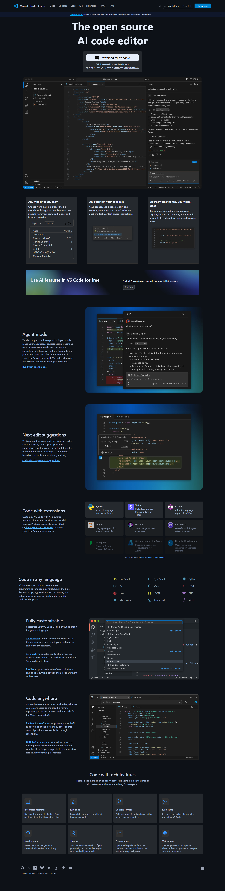
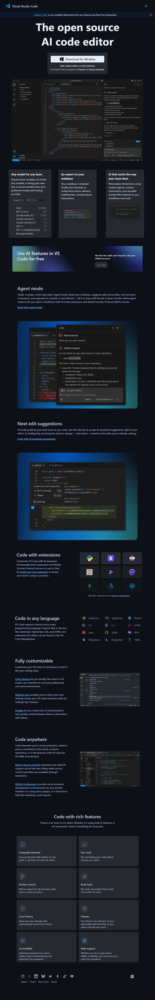

# VS CODE CLONE
## [Live@]()
## Laptop

## Mobile Phone

## Tablet


## 📋Overview
<p>This project is a Visual Studio Code landing page clone, built using HTML, Tailwind CSS, and Font Awesome.</p>
<p>It replicates the modern design and responsiveness of the official VS Code homepage, featuring multiple sections like download buttons, AI features, extensions, and more.<p>

## 🚀Technologies Used
<ul> 
<li>HTML5 — Structure and semantic layout</li>
<li>Tailwind CSS (via CDN) — Styling and responsive design</li>
<li>Font Awesome — Icons for UI elements</li>
<li>Responsive Design — Works across mobile, tablet, and desktop screens</li>
</ul>

## 🧩Key Features
#### <ul>
**<li>Navigation Bar:</li>**
<p>Responsive header with links, search bar, and download button.</p>

**<li>Hero Section:</li>**
<p>Highlighted title and “Download for Windows” button.</p>

**<li> AI Integration Section:</li>**     
<P>Displays cards with model info such as GPT-5, Claude, etc.</p>

**<li>Extensions Showcase:</li>** 
<p>Grid layout displaying popular extensions like Python, Jupyter, and GitLens.</p>

**<li>Language Support:</li>** 
<p>Visual list of supported programming languages.</p>

**<li>Feature Highlights:</li>** 
<p>Cards detailing features like Terminal, Debugging, Git Integration, Themes, and more.</p>

**<li>Footer:</li>** 
<p>Includes social media icons and Microsoft branding.</p>
</ul>

## 📂Structure
```
vs-code-clone/
├── index.html
├── /imgi/                # Folder containing all image assets
│   ├── imgi_1_theme-light copy.svg
│   ├── imgi_5_hero-poster-dark.webp
│   ├── imgi_7_an-expert-on-your-codebase-dark.webp
│   ├── ... etc.
└── README.md
```
